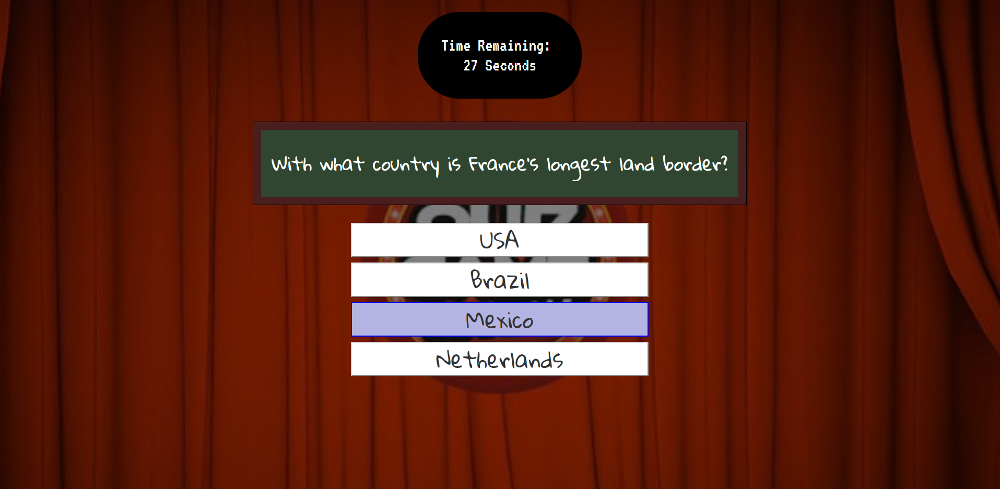

# The Quiz Show Game

As the title says, app is a simple quiz game where you get ALL ANSWERS RIGHT and get ABSOLUTELY NOTHING!!!

Made using basic HTML CSS(Bootstrap), Javascript(jQuery)

## Prerequisites

`Google Chrome`
## Installing 

1. `git clone` the repo to your computer

2. Open index.html on Chrome Browser (or other web browser) 

## Built With
+ [HTML](https://en.wikipedia.org/wiki/HTML)
+ [CSS](https://en.wikipedia.org/wiki/Cascading_Style_Sheets)
+ [BootStrap](https://getbootstrap.com)
+ [JavaScript](https://developer.mozilla.org/en-US/docs/Web/JavaScript)
+ [jQuery](https://jQuery.com)
+ [Google Fonts](https://fonts.google.com/)

### Author 
- Daniel Oh-[danniboi82](http://www.github.com/danniboi82)

